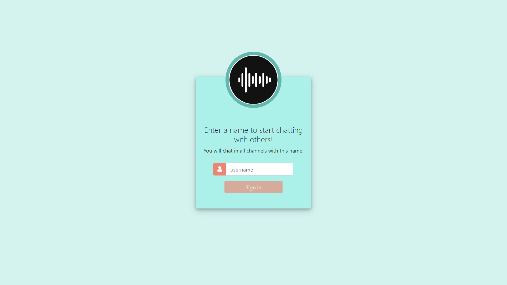

# flaskslack
## Web Programming with Python and JavaScript
### https://courses.edx.org/courses/course-v1:HarvardX+CS50W+Web/course/



## Usage
* Choose a username and login
* Create a new channel or select an existent one
* Start chatting. 
* Logout to leave all chat channels which gives up the username.
* Close browser in chat and re-opening browser will automatically lead to the same chatting
* Creator of the channel can delete the channel
* Non-creator of the channel will not be allowed to delete the channel
* Returning to channel will restore past 100 messages
* (Coming soon) Support sending files
 

## Setup

```bash
# Clone repo
$ git clone this repository

$ cd flaskslack

# Install all dependencies
$ pip install -r requirements.txt

$ export FLASK_APP = application.py
$ export SECRET_KEY = <your secret key>

# Run
$ flask run

# Go to IP address on your web browser.
```
